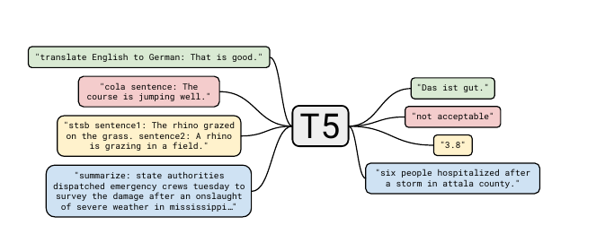

# T5-Fine-tune-Wikihow-XSum :hammer: :wrench:



### Table of Contents

- **[Introduction](#Introduction)**
- **[Setup](#Setup)**
- [**Run the code**](#Run-the-code)
- **[Training](#Training)**
- **[Sample Generation](#Sample-Generation)**
- **[Connect with me](#Connect-with-me)**
- **[License](#License)** 

### Introduction

This is a Pytorch implementation to a summarization model that has been fine-tuned on the top of Google-T5 pre-trained model. The implementation uses HuggingFace `transformers` and `datasets` libraries while model has been fine-tuned on two public summarization datasets, Wikihow and Xsum. For validation and testing the quality of the summary, `rouge-1` metric has been used.

**Caution :raised_hand:** This is a `For-Learning` :green_book: project, where Google-Colab has been used as a running environment, and due to the limited budget :moneybag:  ( at this time :grin:) I could not be able to fully tune the model.

### Setup

The code is using `pipenv` as a virtual environment and package manager. To run the code, all you need is to install the necessary dependencies. open the terminal and type:

- `$ git clone https://github.com/Khamies/T5-Fine-tune-Wikihow-XSum` 
- `$ cd T5-Fine-tune-Wikihow-XSum`
- `$ pipenv install`

or

- `$ pip install requirements.txt `

And you should be ready to go to play with code and build upon it, Yay! :v:

### Run the code

- To train the model, run: `python main.py`
- To train the model with specific arguments, run: `python main.py --tr_batch_size = 4`. The following command-line arguments are available:
  - Dataset: `--dataset` ( currently supporting **`--wiki` and `--xsuum`**)
  - Train batch size: `--tr_batch_size`
  - Validation batch size: `--val_batch_size`
  - Learning rate: `--lr`
  - Metric: `rouge` ( **rouge-1**)
  

### Training

The model is fine-tuned using AdamW as an optimizer with a `learning rate = 0.001` and `batch size = 4`, you can find all the model settings in [settings.py]( https://github.com/Khamies/T5-Fine-tune-Wikihow-XSum/blob/main/settings.py). Here is the loss curve for the training step:

- **Cross Entropy Loss** 

  - **Wikihow**
  
  
  
  - **Xsum**
  
    

### Sample Generation

Here are some generated samples from the model:

- Wikihow

​	**Paragraph**

```markdown
It can be difficult to figure out emotions or feelings if you're autistic, so the first thing to do is to determine if you have a crush on this person. Find a way of sorting out what you feel by writing it out or talking about it with a trusted friend, and look for any key signs that you might have a crush. Does this person cause a jumble of thoughts to come rushing into your head all at once? You could have a crush on them. If you want to spend most of your time with this person, or if something exciting happens and you wish they were there to see it, then you may have a crush. 

If you stim when excited or nervous, try to keep an eye on how much you're stimming whenever you're around this person. If you start stimming a lot whenever you think of or are around this person, then it's possible you have a crush. If you smile a lot when thinking about them or talking to them, you could possibly have a crush. If you could previously speak somewhat smoothly around this person, and now you're suddenly tripping over your words, or are unsure of what to say all the time around them, you could have a crush. If you are shy around this person and are afraid of the impression you'll give off in conversation, you probably have a crush. 

If you regularly fantasize about spending time with this person, or even things like dating or kissing them, you definitely have a crush.;, If you do have a crush, pretending that you don't have a crush isn't a very good course of action! While it can seem like a great way of dealing with it, when you eventually end up admitting it to yourself, it'll only end up making it worse. It's important to accept your feelings and recognize how you think of this person. Sometimes, crushes can make you feel funny or like there's something wrong with you. It's important to realize that there's nothing wrong with having a crush on someone, and that most people end up getting a crush at some point in their life. As long as you respect the person you have a crush on and don't do anything to intentionally make them uncomfortable, there's nothing wrong with liking someone
```

**Machine Summary**

```
Determine if you have a crush on this person. 
Keep an eye on how much you're stimming. 
Recognize how you think of this person. 
Know that there's nothing wrong with having a crush.
```

- Xsum

​	**Paragraph**

```markdown
The move is in response to an £8m cut in the subsidy received from the Department of Employment and Learning (DEL). The cut in undergraduate places will come into effect from September 2015. Job losses will be among both academic and non-academic staff and Queen's says no compulsory redundancies should be required. There are currently around 17,000 full-time undergraduate and postgraduate students at the university, and around 3,800 staff. Queen's has a current intake of around 4,500 undergraduates per year. 

The university aims to reduce the number of student places by 1,010 over the next three years. The BBC understands that there are no immediate plans to close departments or courses, but that the cuts in funding may put some departments and courses at risk. The Education Minister Stephen Farry said he recognised that some students might now choose to study in other areas of the UK because of the cuts facing Northern Ireland's universities. "Some people will now be forced to look to opportunities in other parts of Great Britain and may not return to our economy," he said. "Defunding our investment in skills, particularly at a time when we're trying to grow the economy does not make a lot of sense. What's happening is we're going backwards. "The loss of any place is damaging to our economy, all subjects teach our young people critical skills." Queen's vice-chancellor Patrick Johnston said the cuts had the potential to damage the reputation of the university. "The potential negative impact, not just on the university but on the local economy is very significant," he said. "It's the last thing we want to do, but we have to begin to focus on those areas where we can grow the organisation and develop it - it's clear we can no longer depend on the public purse to fund tuition. 

If we're not competitive we will not attract the best students, and we will not attract the best staff." Just under £100m, a third of the university's income, comes from the Northern Ireland Executive. DEL's budget was reduced by £62m earlier this year, and its budget for higher education institutions fell from £203m to £186m, a reduction of 8.2%. Ulster University announced in February that it was dropping 53 courses. It will be cutting jobs and student places, but it has not yet revealed how many.
```

**Machine Summary**

```
The number of full-time undergraduate and postgraduate students at the University of Northern Ireland's Queen's has been cut by £100m over the next three years.
```


## Citation

> ```
> @misc{Khamies2021T5Fine-tune-Wikihow-XSum,
> author = {Khamies, Waleed},
> title = {A pytorch Google-T5 fine-tuned summarization model on Wikihow and Xsum datasets.},
> year = {2021},
> publisher = {GitHub},
> journal = {GitHub repository},
> howpublished = {\url{https://github.com/Khamies/T5-Fine-tune-Wikihow-XSum}},
> }
> ```

### Connect with me :slightly_smiling_face:

- Who is this dude ? [check here](https://khamies.github.io/about/)  :kissing_smiling_eyes:
- For any question or a collaboration, drop me a message [here](mailto:khamiesw@outlook.com?subject=[GitHub]%20LSTM-Language-Generator%20Repo) :smiley:

- Follow me on [Linkedin](https://www.linkedin.com/in/khamiesw/)!  :blush:

**Thank you :heart:**

### License 


